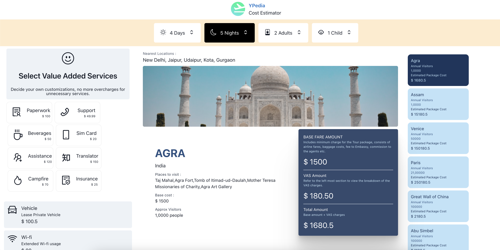

# YPedia

An demonstration of the Expedia app made using Chakra.js (https://chakra-ui.com/) and ReactJS.



# Build and run the code
1. Install dependencies
```
npm install --verbose
```
2. Start the project
```
npm run start
```